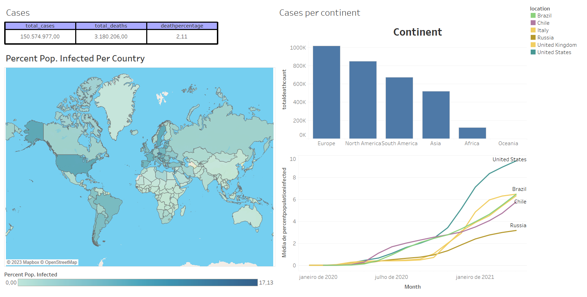

## Covid SQL/Tableau Project

> This project is very simple, I downloaded the data available on the website (https://ourworldindata.org/covid-deaths) that have various information about COVID. I selected a shorter period of time so the dataset wouldnt have a large amount of data, but it is possible to get the data up to the present day.

> The data is made avaible in a CSV file, after that I used Python to pass the data to a database in postgreSQL, and there I performed some queries to better explore the data. After exploring the data I chose some queries to use in Tableau, generating in the end a dashboard!

